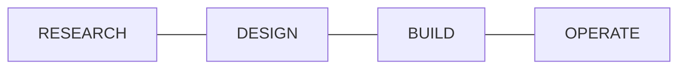
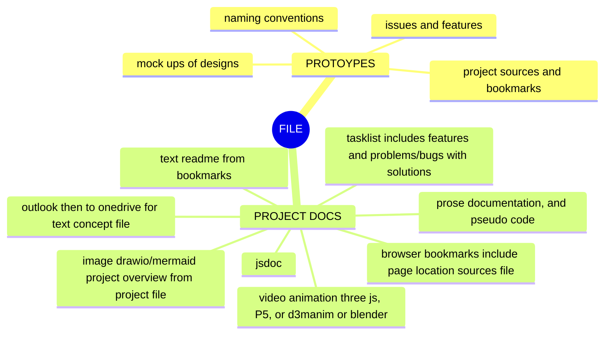
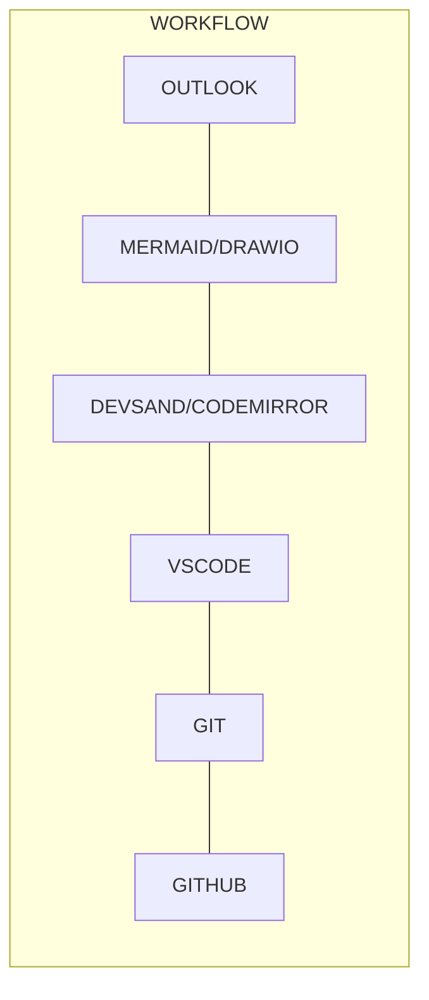
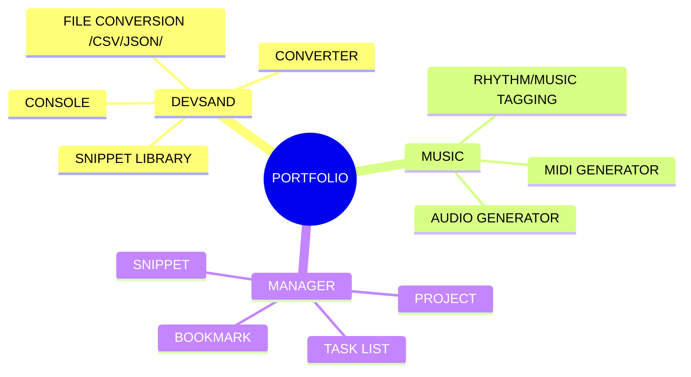

<h2>PROJECTS</h2>

<ul>
<li>Manager Suite</li>
<ul>
 <!--
<a href="#">    <li>Project Manager</li></a>
<a href="#">    <li>Task Manager</li></a>
  -->
<a href="https://1960s.github.io/manager-snippets/">    <li>Snippets Manager</li></a>
<a href="https://1960s.github.io/manager-bookmarks/">    <li>Bookmarks Manager</li></a>
</ul>
 <li>Code Editor</li>
<ul>
<a href="https://1960s.github.io/editor-devsand6">    <li>Devsand6</li></a>
<a href="https://1960s.github.io/editor-devsand5">    <li>Devsand5</li></a>
  <!--
<a href="#">    <li>Monaco</li></a>
  -->
</ul>
<li>Music</li>
<ul>
  <!--
<a href="#">    <li>Rhythm Tagging System</li></a>
<a href="#">    <li>Tonal Tagging System</li></a>
<a href="#">    <li>Text <=> Midi Editor (Dawless)</li></a>
<a href="#">    <li>Music Generation</li></a>
  -->
</ul>

<!--

[DEVICON](https://devicon.dev/)

-->

