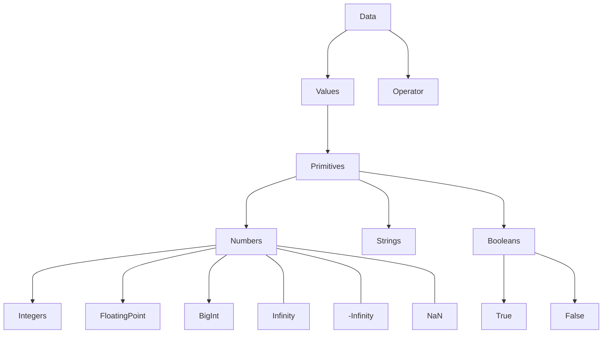
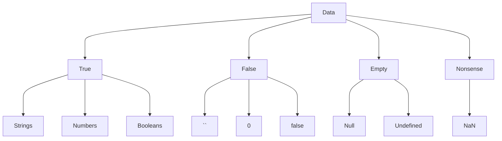

# Javascript
## Values, Types, and Operators

| Data Types | Column2 | Column3 | Bits |
| ---------- | ------- | ------- | ---- |
| Number     |         |         | 64   |
| String     |         |         | 16   |
| Boolean    |         |         | ?    |
| Row4       |         |         |      |

| Operators       | Numbers | Strings    | Array                       |
| --------------- | ------- | ---------- | --------------------------- |
| add             | +       | +          | .push(), flat()             |
| subtract/remove | -       | .replace() | .pop(), unshift(), splice() |
| multiply        | *       | .repeat()  |                             |
| divide          | /       | .split()   |                             |

| Operators | Type   | Quantity | Column4 |
| --------- | ------ | -------- | ------- |
| +         | String | unary    |         |
| -         | Number | binary   |         |
| *         |        | ternary  |         |
| /         |        | binary   |         |

| Column1  | Empty Type     | Column3 | Column4 |
| -------- | -------------- | ------- | ------- |
| String   | ""             |         |         |
| Number   | 0              |         |         |
| Boolean  | false          |         |         |
| Array    | []             |         |         |
| Object   | {}             |         |         |
| none     | null/undefined |         |         |
| nonsense | NaN            |         |         |

