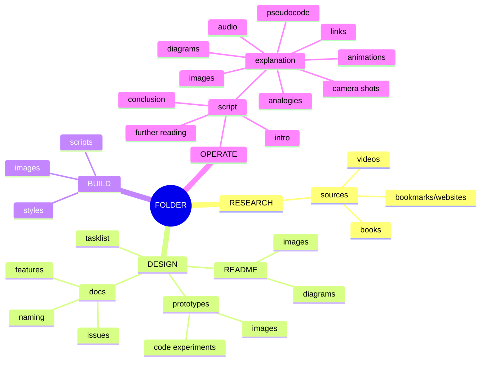

- start ideas in tasklist file
  - log issues and features on github after first revision of ideas
  - script explains making ideas and any solutions to issues encountered
  - video animation use
    - three js
    - P5
    - d3
    - manim
    - blender
- keep prototypes as well, concept art and mockups
  - use jsdoc during mockups
- keep a list of sources in source file, how to easily keep sources
