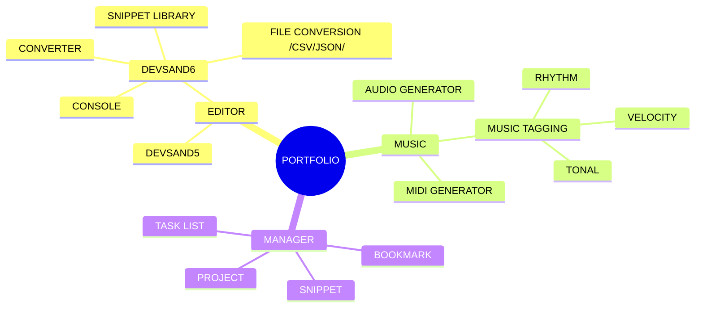
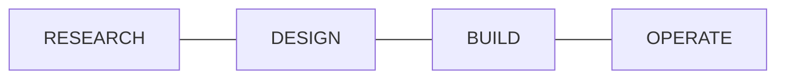
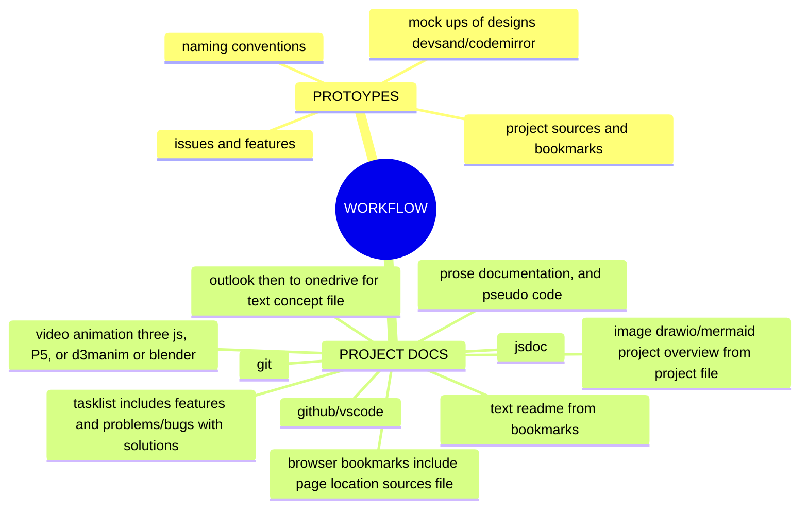

```mermaid
mindmap
root((PORTFOLIO))
    EDITOR
        DEVSAND5
        DEVSAND6
            SNIPPET LIBRARY
            CONVERTER
            CONSOLE
            FILE CONVERSION /CSV/JSON/

    MUSIC
        MUSIC TAGGING
            RHYTHM
            TONAL
            VELOCITY
        MIDI GENERATOR
        AUDIO GENERATOR

    MANAGER
        TASK LIST
        BOOKMARK
        SNIPPET
        PROJECT

```

```mermaid
graph LR
RESEARCH---
DESIGN---
BUILD---
OPERATE
```

```mermaid
mindmap
root((WORKFLOW))
    PROTOYPES 
        mock ups of designs devsand/codemirror
        project sources and bookmarks
        issues and features
        naming conventions
    PROJECT DOCS
        git
        github/vscode
        tasklist includes features and problems/bugs with solutions
        outlook then to onedrive for text concept file
        prose documentation, and pseudo code
        browser bookmarks include page location sources file
        text readme from bookmarks
        image drawio/mermaid project overview from project file
        video animation three js, P5, or d3manim or blender
        jsdoc

```

<!--

[DEVICON](https://devicon.dev/)

-->