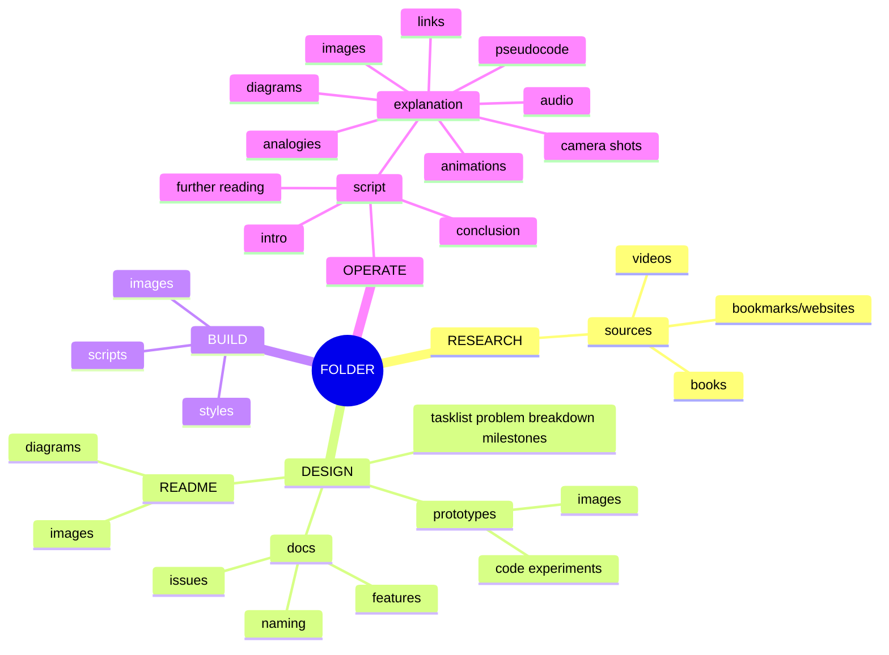

- start ideas in tasklist file
  - log issues and features on github after first revision of ideas
  - script explains making ideas and any solutions to issues encountered
  - video animation use
    - three js
    - P5
    - d3
    - manim
    - blender
- keep prototypes as well, concept art and mockups
  - use jsdoc during mockups
- keep a list of sources in source file, how to easily keep sources

setup workflow and files
turn text ideas into pictures and animation to illustarte ideas
project to milestone to issue to tasklist
tools and resources and used list in sources file
issues category and types of category, ex improvement type = feature or problem, genre audio, sub genre music, piepleine research type
ui buttons parameters for programs make variables all accessible in interface

